<h1 align="center">基于Spring Boot 的教学资料管理系统【带论文】</h1>

- <b>完整代码获取地址：从戎源码网 ([https://armycodes.com/](https://armycodes.com/))</b>
- <b>技术探讨、资料分享，请加QQ群：692619798</b>
- <b>作者微信：19941326836  QQ：3645296857</b>
- <b>承接计算机毕业设计、Java毕业设计、Python毕业设计、深度学习、机器学习</b>
- <b>选题+开题报告+任务书+程序定制+安装调试+论文+答辩ppt 一条龙服务</b>
- <b>所有选题地址 ([https://github.com/Descartes007/allProject](https://github.com/Descartes007/allProject)) </b>

## 一、项目介绍

### 基于 Spring Boot 的教学资料管理系统，系统角色为管理员、老师，主要功能如下
### 管理员：
- 基本操作：登录、注册、修改密码、获取/修改个人信息、登出
- 用户管理：查询用户列表（分页/不分页）、查看用户详情、新增用户、修改用户、批量删除、重置密码、获取 session 用户信息
### 教学资料管理：教学资料分页查询、查看详情（含课程/老师级联信息）、新增教学资料（含文件、版本、分享设置）、修改教学资料、删除教学资料
### 课程/老师/学生/班级 管理：课程、教师、学生、班级 的分页查询、查看详情、新增、修改、删除、批量导入
- 文件管理：文件上传（保存至 classpath:static/upload）、文件下载
### 老师：
- 基本操作：登录、修改密码、获取/修改个人信息、登出
- 教学资料管理：查看/新增/修改/删除自己上传的教学资料、教学资料分页查询与详情（含级联课程信息）
### 课程/班级/学生管理：查看与管理所属课程、班级与学生信息（受权限限制）
- 文件管理：上传/下载教学资料文件

## 二、项目技术

- 编程语言：Java（后端）
- 项目架构：B/S 架构，前后端分离（前端基于 Vue，后端为 Spring Boot 应用）
- 前端技术：Vue 2、Vue Router、Axios、Element UI、ECharts、vue-quill-editor（富文本）
- 后端技术：Spring Boot、MyBatis-Plus（基于 MyBatis 的 ORM 扩展）、自定义 Token 验证与 HttpSession 结合、Maven 构建、MySQL

## 三、运行环境

- JDK版本：1.8及以上都可以
- 操作系统：Windows7/10、MacOS
- 开发工具：IDEA、Ecplise、MyEclipse都可以

## 四、数据库配置文件

- npm版本：6.14.13及以上都可以
- Redis版本：3.2.100及以上都可以
- 文件名：application.yml
- 编码类型：utf8

## 论文截图

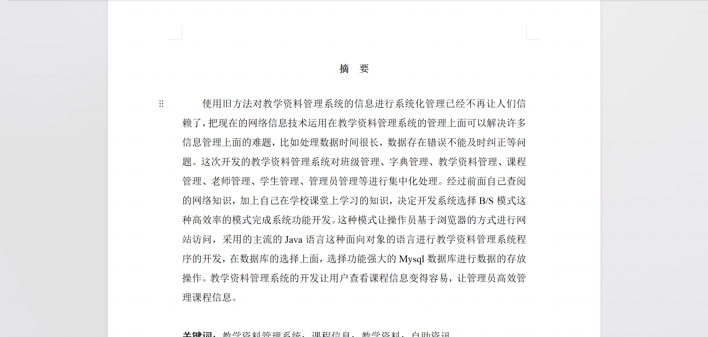

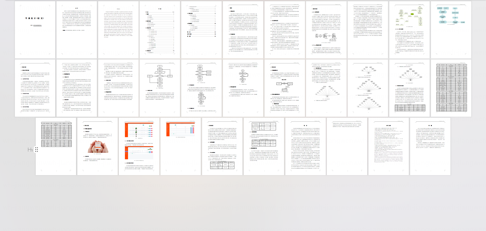

## 系统截图

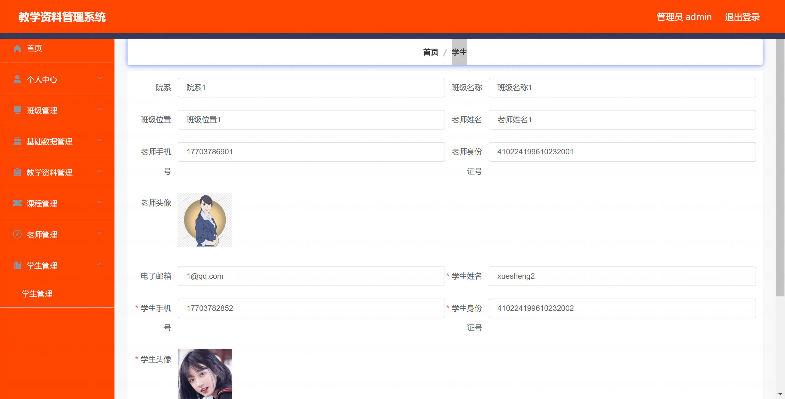

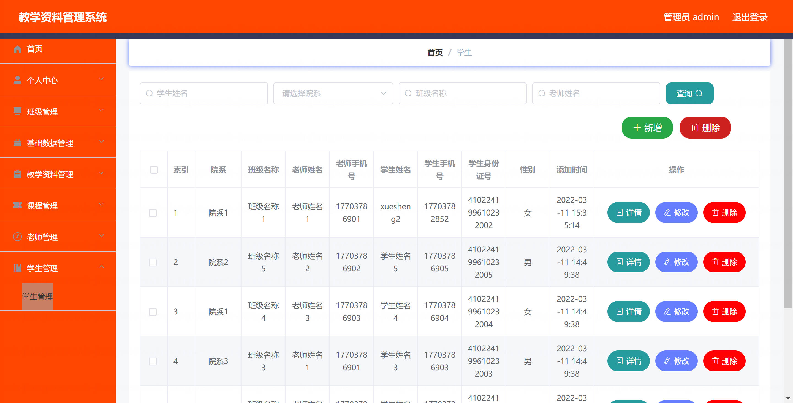

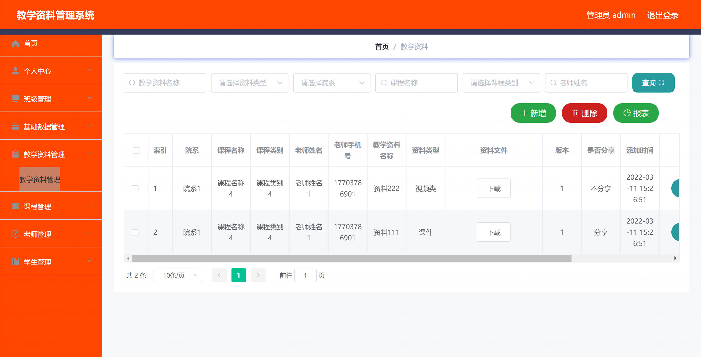

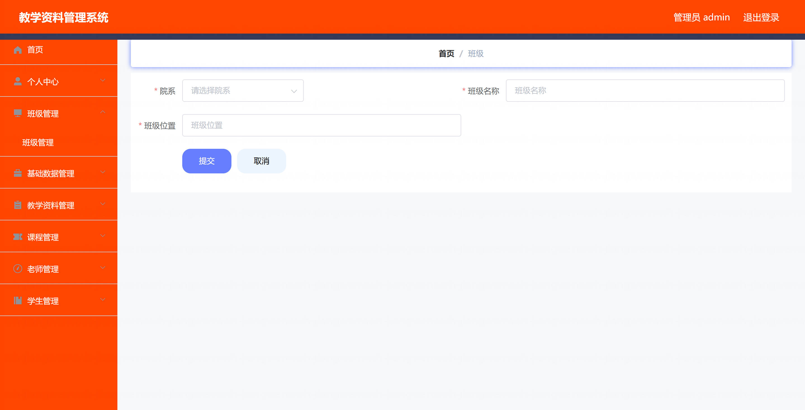

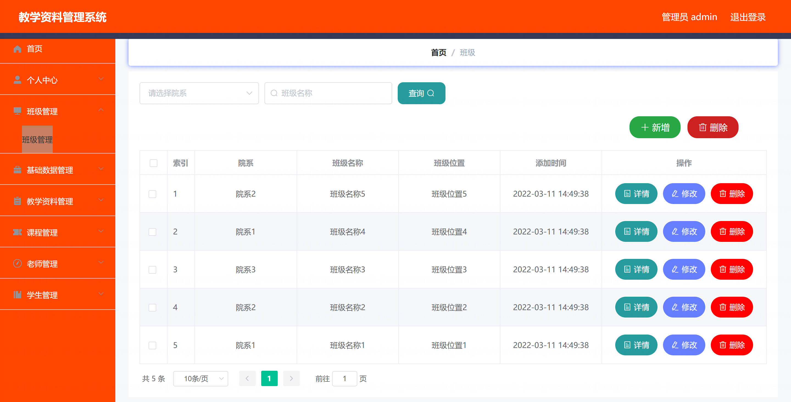

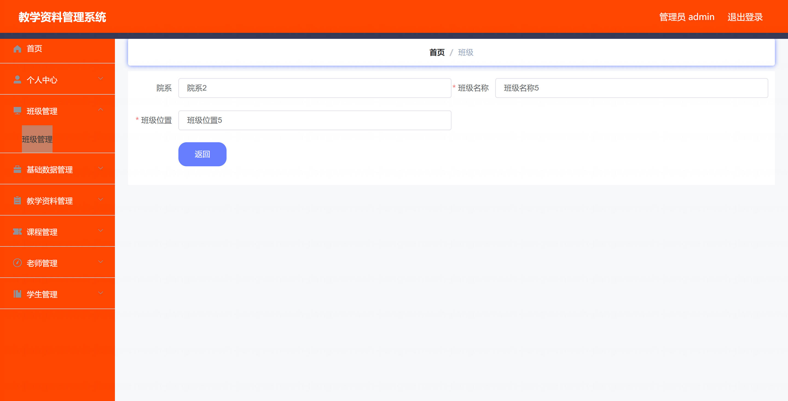

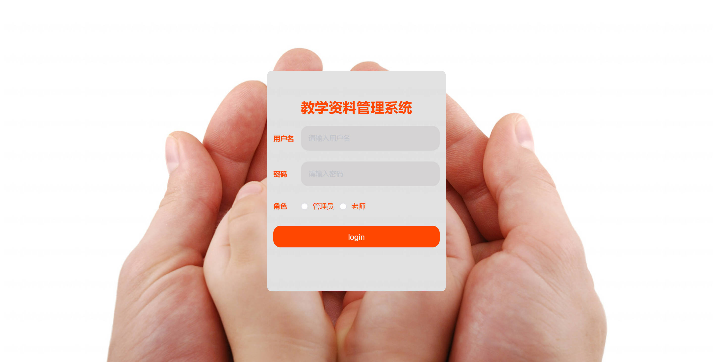

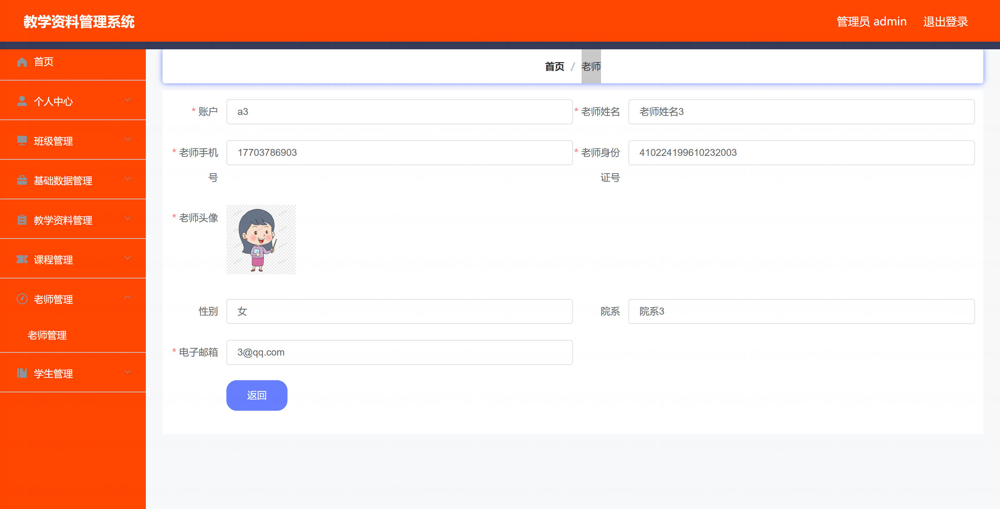

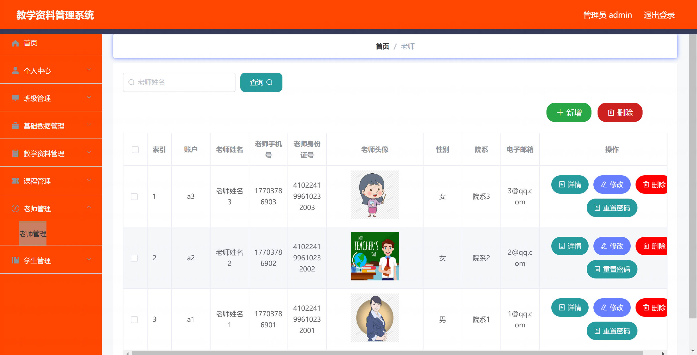

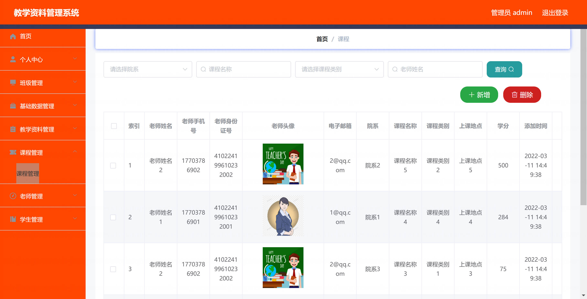